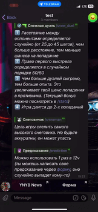

 (Ru/En)

# About

Moroz New Year's bot is a multilingual bot with simple games right inside Telegram for a New Year's event inside Yandex for support staff

# Usage Display

    
/prediction and /stats

     

    
/snow_duel

     

    
/snowman

    

    
/snow

    

## Technology

* [aiogram](https://github.com/aiogram/aiogram) — asyncio Telegram Bot API framework
* [cachetools](https://cachetools.readthedocs.io/en/stable) — for anti-flood throttling mechanism
* [Docker](https://www.docker.com) and [Docker-Compose](https://docs.docker.com/compose) — quickly deploy bot in containers
* [Fluent](https://projectfluent.org/python-fluent/) — multilingualism depending on the user's chosen language in telegram (supported by RU and ENG)
* [Pydantic](https://docs.pydantic.dev/latest/) — abandoning the use of dictionaries in favor of validation
* [Redis](https://yandex.cloud/ru/services/managed-redis) — persistent data storage
* [YDB](https://github.com/ydb-platform/ydb) and [ydb-python-sdk](https://github.com/ydb-platform/ydb-python-sdk) — for storing data about telegram groups and users

And also used:
* [Yandex Forms](https://yandex.ru/support/forms/ru/create-task) — to add a complaints, feedback and new prediction for the [game of the same name](handlers/games/prediction.py) (using integration with **Yandex Tracker**)
* [Yandex Tracker](https://yandex.cloud/ru/docs/tracker/) + [yandex_tracker_client](https://github.com/yandex/yandex_tracker_client) — processing issues and predictions created from the **Yandex Form**
* [Cloud Functions](https://yandex.cloud/ru/docs/functions/lang/python/) — running the script (cron-task) [**hydrartew/yc_functions_predictions**](https://github.com/hydrartew/yc_functions_predictions) for add processed predictions from **Yandex Tracker** to database **YDB**
* [Yandex Wiki](https://yandex.cloud/en/docs/wiki/create-grid) dynamic tables + API — to display leaderboards for games
* [Yandex Compute Cloud](https://yandex.cloud/ru/docs/compute/) (ВМ Linux) — for hosting a bot
* [Cloud Logging](https://yandex.cloud/ru/docs/logging/tutorials/vm-fluent-bit-logging) — transfer logs from a VM instance

## Installation and launch

1. Rename `env_example` file to `.env` and open it
2. Get telegram bot token from [@BotFather](https://t.me/botfather) and fill in the `TELEGRAM_BOT_TOKEN` variable
3. Create database YDB - https://yandex.cloud/ru/docs/ydb/quickstart#create-db
4. Fill in the variables [YDB_DATABASE](https://ydb.tech/docs/ru/concepts/connect#database) and [YDB_ENDPOINT](https://ydb.tech/docs/ru/concepts/connect#endpoint) with the appropriate data
5. Create Redis cluster - https://yandex.cloud/ru/docs/managed-redis/quickstart#cluster-create
6. Fill in the variables `REDIS_HOST`, `REDIS_PASSWORD`, and `REDIS_PORT` with the appropriate data (https://yandex.cloud/ru/docs/managed-redis/operations/cluster-list)
7. Run the docker container with `docker compose up -d` command